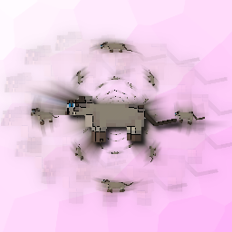

# MeowConfig

Blazingly-fast, customizable and tracked meows

## Dependencies

- [Fabric API](https://modrinth.com/mod/fabric-api)
- [OneConfig](https://modrinth.com/mod/oneconfig)

## Features

- **Triggers**: Trigger on intervals, chat messages, or manually.
- **Customization**: Customize how meows get presented and customize every last detail of the message.
- **Effects**: Play different sounds on meows.
- **Tracking**: Track different meowing statistics.